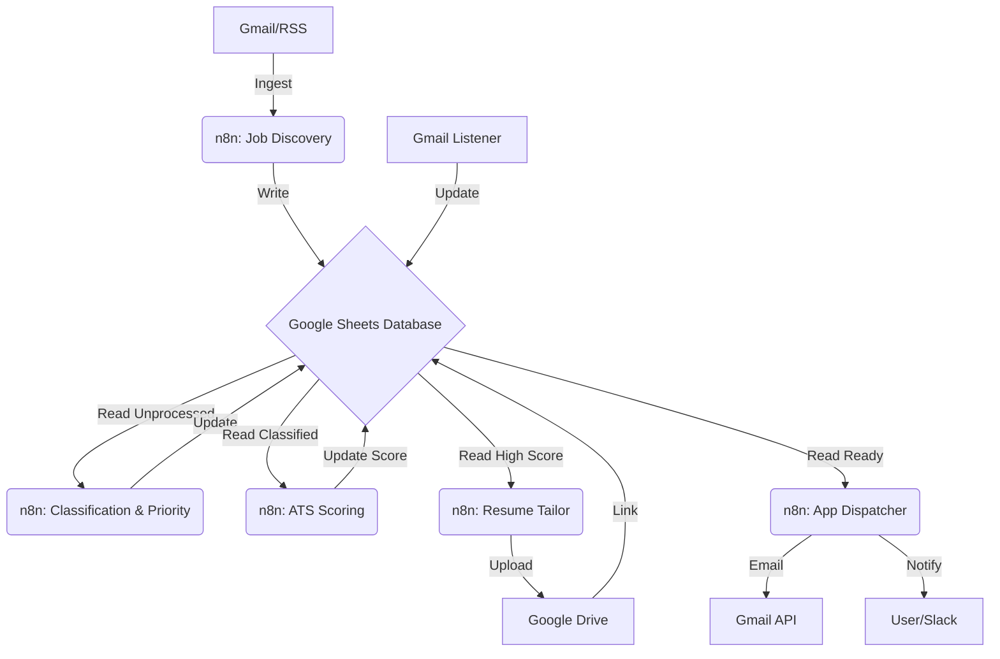

# System Architecture: Ethical Job Automation

## 1. High-Level Overview
This system is an autonomous "Human-in-the-Loop" agent that discovers, evaluates, and applies to jobs. It operates on a **Pull & Push** model:
- **Pull**: Ingests job alerts from Gmail and RSS feeds.
- **Push**: Sends email applications or notifies the user for portal actions.

The **Single Source of Truth (SSOT)** is a specific Google Sheet. All state changes (New -> Analyzed -> Applied) happen there.

## 2. Core Principles
- **Ethical Compliance**: No fake experience. No white-text hacking.
- **Platform Safety**: No Selenium/Puppeteer for job portals (prevents IP bans).
- **Google Ecosystem**: Uses standard OAuth APIs for security.
- **Deterministic Identity**: Jobs are deduped using `SHA256(job_url)`.

## 3. Component Interaction

## 4. Gmail Handling Strategy
To maintain reputation and organization:
- **Sending Identity**: Use a dedicated application alias if possible, or main account with strict limits.
- **Labels**:
  - `JobBot/Ingest`: Incoming alerts (filter rules applied).
  - `JobBot/Applied`: Sent applications.
  - `JobBot/Replies`: Responses captured by the monitor.
- **Rate Limiting**: Max 50 applications/day to avoid spam classification.

## 5. Security & Auth
- **Credentials**: Stored in n8n Credentials store (OAuth2 for Google).
- **Secrets**: API keys (LLM) stored in n8n.
- **Isolation**: Workflows run on a local/VPS instance, not shared cloud.

## 6. Error Handling Strategy
- **Transient Errors** (Network/API): Retry 3 times with exponential backoff.
- **Permanent Errors** (Auth failure, Format change): 
  - Log to `System_Logs` sheet.
  - Alert User via Slack/Email.
  - Pause specific workflow.
